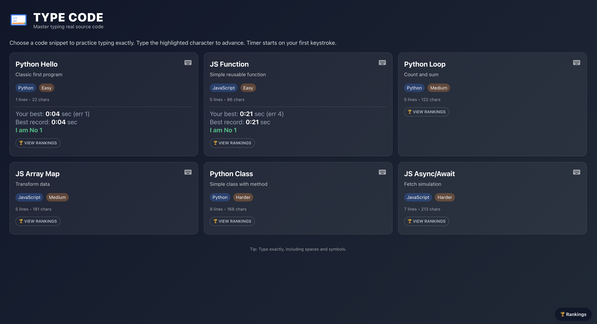

[Type Code] is a Semiblock educational module that trains coding fluency by having users type real, useful source code snippets instead of random text.

## What is Type Code?

- Practice typing actual runnable programs in Python and JavaScript
- Lessons range from simple "Hello World" to classes, loops, array methods, and async/await
- Real-time feedback: errors are highlighted as you type
- Metrics: live timer, error count, WPM (words per minute), and accuracy %
- Only your personal bests are saved (faster time, or same time with fewer errors)
- Global rankings and per-lesson leaderboards (privacy-friendly display names)
- "Rankings" floating action button + in-app ranking dialogs

## How it works in the platform

